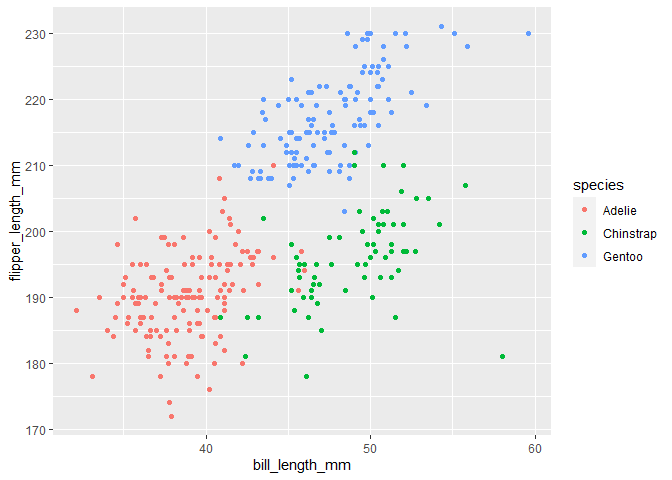

p8105_hw1_zl3263
================
2022-09-23

## Problem 1

**Import library and dataset:**

``` r
library(tidyverse)
```

    ## ── Attaching packages ─────────────────────────────────────── tidyverse 1.3.2 ──
    ## ✔ ggplot2 3.3.6      ✔ purrr   0.3.4 
    ## ✔ tibble  3.1.8      ✔ dplyr   1.0.10
    ## ✔ tidyr   1.2.0      ✔ stringr 1.4.1 
    ## ✔ readr   2.1.2      ✔ forcats 0.5.2 
    ## ── Conflicts ────────────────────────────────────────── tidyverse_conflicts() ──
    ## ✖ dplyr::filter() masks stats::filter()
    ## ✖ dplyr::lag()    masks stats::lag()

``` r
data("penguins", package = "palmerpenguins")
```

The variable names are as follow: species, island, bill_length_mm,
bill_depth_mm, flipper_length_mm, body_mass_g, sex, year

It contains 344 rows and 8 columns.

The mean flipper length is 200.9152047 with NA value in this column been
directly removed.

**Create scatter plot:**

The NA in each row is removed through `drop_na` , the resulted fig is
saved as png file.

``` r
penguinsFiltered = drop_na(penguins)
ggplot(data = penguinsFiltered, 
       aes(x = bill_length_mm, y = flipper_length_mm, color = species)) + geom_point()
```

<!-- -->

``` r
ggsave("Bill_FlipperLength.png")
```

    ## Saving 7 x 5 in image

## Problem 2

**Create data frame using tibble:**

``` r
df = tibble(
  randNorm = rnorm(10),
  isPos = randNorm > 0,
  strSeq = c('a1','a2','a3','a4','a5','a6','a7','a8','a9','a10'),
  varFactor = factor(c('a','a','b','b','c','c','c','c','c','c'))
  
)
df
```

    ## # A tibble: 10 × 4
    ##    randNorm isPos strSeq varFactor
    ##       <dbl> <lgl> <chr>  <fct>    
    ##  1    0.408 TRUE  a1     a        
    ##  2   -1.09  FALSE a2     a        
    ##  3   -0.612 FALSE a3     b        
    ##  4    0.437 TRUE  a4     b        
    ##  5    0.488 TRUE  a5     c        
    ##  6    0.992 TRUE  a6     c        
    ##  7    0.106 TRUE  a7     c        
    ##  8   -0.352 FALSE a8     c        
    ##  9    0.974 TRUE  a9     c        
    ## 10    0.474 TRUE  a10    c

**Make mean of each variable:**

``` r
mean(pull(df,randNorm))
```

    ## [1] 0.182663

``` r
mean(pull(df,isPos))
```

    ## [1] 0.7

``` r
mean(pull(df,strSeq))
```

    ## [1] NA

``` r
mean(pull(df,varFactor))
```

    ## [1] NA

Mean works on the Numeric and Logic type but cannot work on Character
and Factor.

``` r
as.numeric(df$isPos)
as.numeric(df$strSeq)
as.numeric(df$varFactor)
```

`as.numeric` turned logic variableto 0 and 1. It turned factor to
ordered number series and character to NA. It helps to explain the mean
of logic variable.
